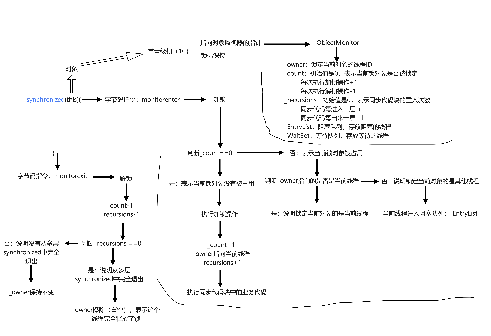
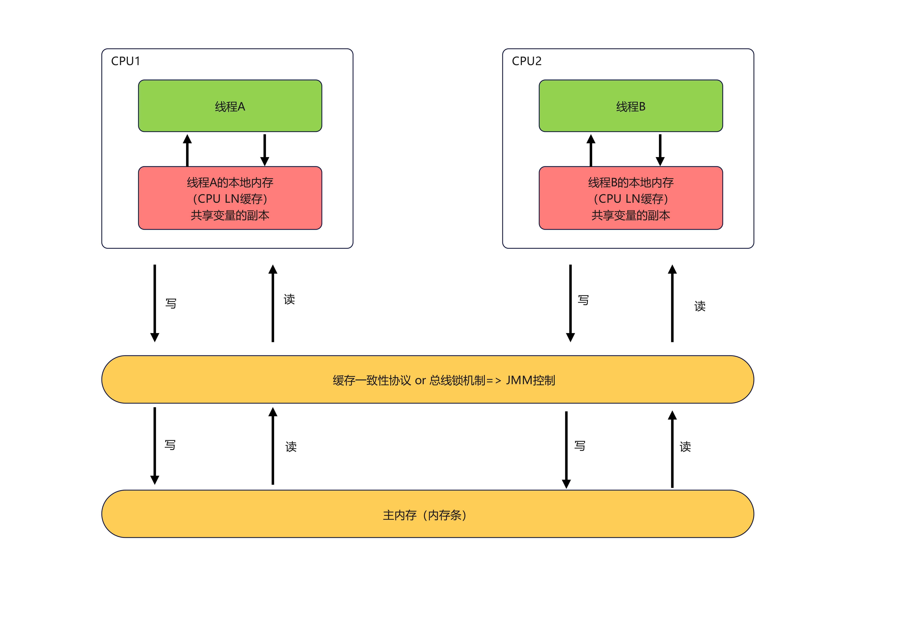
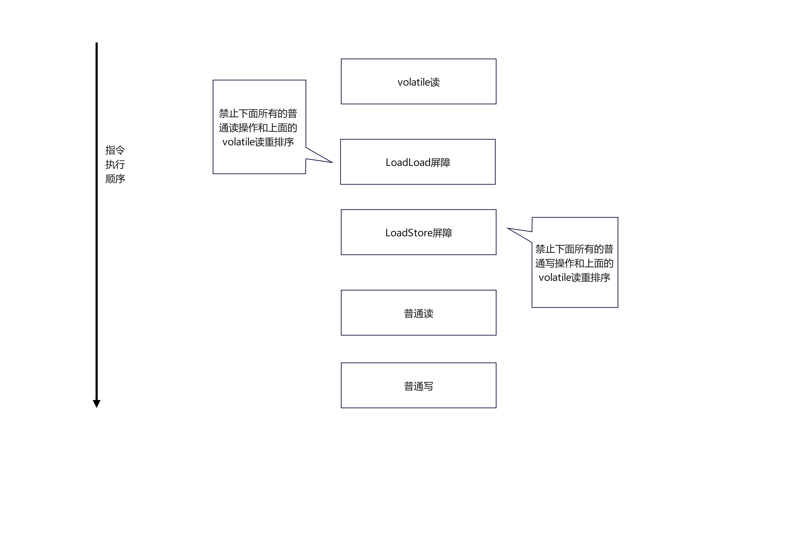
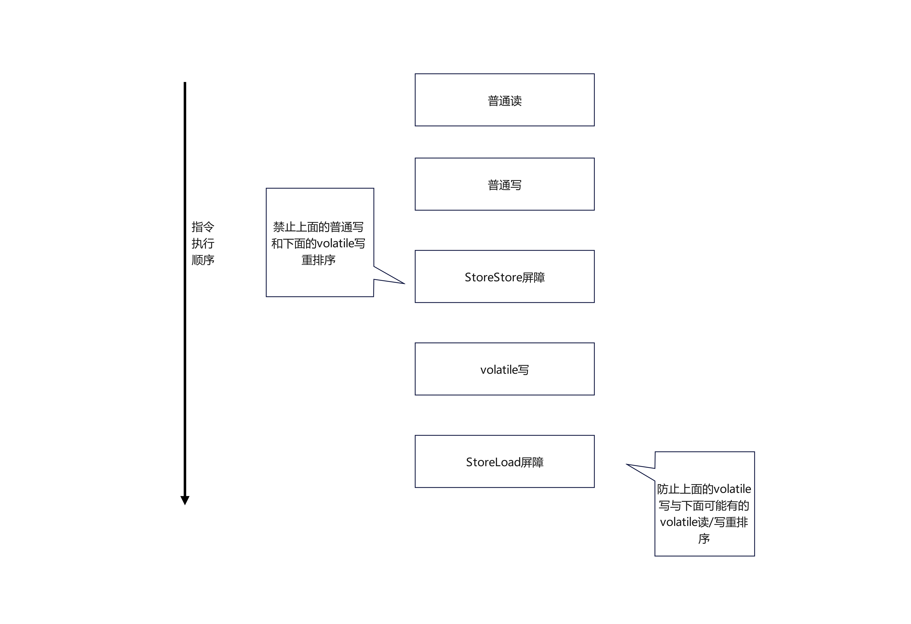
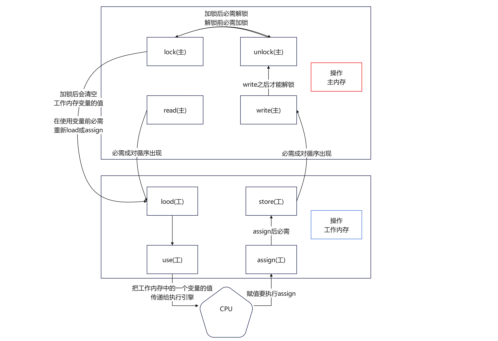

# 第1章--前置知识及要求说明

# 第2章--基础知识复习

## java多线程相关概念

- 1把锁:synchronized
- 2个并:并发，并行
- 3个程:进程,线程，管程（monitor,也就是平时说的锁，多个工作线程互斥访问共享资源）

## 用户线程和守护线程

java 线程默认是用户线程

- User Thread:系统的工作线程，用户线程的结束会导致整个程序的结束
- Daemon Thread：守护线程，守护线程的结束不会导致整个程序的结束，守护线程通常用来执行一些后台任务，如垃圾回收、日志记录等。

# 第3章--CompletableFuture

## Future接口理论知识复习

Future接口(FutureTask实现类)定义了操作异步任务执行一些方法

## Future接口常用实现类FutureTask异步任务

Runnable接口
Callable接口
Future接口和FutureTask实现类

目的：异步多线程任务执行且返回有结果， 三个特点：多线程/有返回/异步任务
Thread(Runnable target, String name)

FutureTask 满足上述三个条件（见chapter03-CompletableFutureDemo）

Future对结果的获取不是很友好，只能通过阻塞或轮询的方式得到任务的结果

## CompletableFuture对Future的改进

- CompletableFuture<T> implements Future<T>, CompletionStage<T>
- CompletionStage 代表异步计算过程中的某一个阶段，一个阶段完成以后可能会触发另外一个阶段

### 核心的四个静态方法

- 无返回值
- runAsync(Runnable runnable)
- runAsync(Runnable runnable, Executor executor)

- 有返回值
- supplyAsync(Supplier<U> supplier)
- supplyAsync(Supplier<U> supplier, Executor executor)

上述Executor executor参数，没有指定Executor的方法，直接使用默认的ForkJoinPool.commonPool()线程池来执行异步任务

## CompletableFuture的优点

从java8开始引入了CompletableFuture,它是Future的功能增强版，减少阻塞和轮询，可以传入回调对象，当异步任务完成或者发生异常时，自动调用回调对象的回调方法

- 异步任务结束时，会自动回调某个对象的方法；
- 主线程设置好回调后，不再关心异步任务的执行，异步任务之间可以顺序执行
- 异步任务出错时，会自动回调某个对象的方法

## java8中引入的函数式接口

| 函数式接口名称    | 方法名称   | 参数   | 返回值  |
|------------|--------|------|------|
| Runnable   | run    | 无参数  | 无返回值 | 
| Function   | apply  | 1个参数 | 有返回值 | 
| Consumer   | accept | 1个参数 | 无返回值 | 
| Supplier   | get    | 无参数  | 有返回值 | 
| BiConsumer | accept | 2个参数 | 无返回值 |

## CompletableFuture的常用方法

1. 获得结果和触发计算
    - 获取结果
        - get()   不见不散（阻塞）
        - get(long timeout, TimeUnit unit)  过时不候（阻塞）
        - join()   抛出运行时异常异常（阻塞）
        - getNow(T valueIfAbsent)   没有计算完成的情况下，返回valueIfAbsent值（不阻塞）
    - 主动触发计算
        - complete(T value)   是否打断get方法立即返回括号值
2. 对计算结果进行处理（见chapter03/CompletableFutureAPI2Demo）
    - thenApply(Function<? super T,? extends U> fn) 计算完成后对结果进行转换  (
      计算结果存在依赖关系，这两个线程串行化;由于存在依赖关系，当前步骤有异常的话就被叫停)
    - handle(BiFunction<? super T, Throwable, ? extends U> fn) 计算完成后对结果进行转换，或者对异常进行处理
      （计算结果存在依赖关系，这两个线程串行化; 有异常也可以往下一步走，根据带的异常参数可以进一步处理）
3. 对计算结果进行消费 （见chapter03/CompletableFutureAPI3Demo）
    - thenAccept(Consumer<? super T> action) 计算完成后对结果进行消费,无返回结果（计算结果存在依赖关系，这两个线程串行化）
4. 线程池运行选择 （见chapter03/CompletableFutureWithThreadPoolDemo）
   已thenRun和thenRunAsync为例，thenRun在当前线程执行，thenRunAsync在默认线程池执行，当然也可以指定线程池
5. 对计算速度进行选用 (见chapter03/CompletableFutureFastDemo)
   applyToEither和acceptEither方法，applyToEither有返回值，acceptEither无返回值，两个方法都是哪个线程计算完成了就用哪个线程的结果
6. 对计算结果进行合并
   thenCombine方法，两个CompletionStage任务都完成后，最终能把两个任务的结果一起交给thenCombine来处理，合并的结果有返回值

# 第4章--说说java“锁”事

## 乐观锁与悲观锁

- 悲观锁：认为在多线程环境下，数据被修改的概率很大，所以每次操作数据时都要加锁，保证数据的安全性。常见的悲观锁有synchronized和ReentrantLock。（适合写操作多的场景）
- 乐观锁：认为在多线程环境下，数据被修改的概率很小，所以每次操作数据时不加锁，而是在提交数据时进行版本检查，如果版本不一致则重试。
  常见的乐观锁有CAS（Compare And Swap）和基于版本号的乐观锁。（适合读操作多的场景，并发性得到了加强）

## 8锁案例

见chapter04/Lock8Demo，注释中即为8种加锁demo

8种锁的案例实际体现在3个地方：

1. 作用于实例方法，当前实例加锁，进入同步代码前要获得当前实例的锁
2. 作用于代码块，对括号里配置的对象加锁
3. 作用于静态方法，当前类加锁，进入同步代码前要获得当前类对象的锁

同步代码块（见chapter04/LockSyncDemo）实现是：
monitorenter 和 monitorexit 指令，monitorenter指令会尝试获取对象的锁，如果获取成功就进入同步代码块，如果获取失败就进入阻塞状态；monitorexit指令会释放对象的锁。

同步实例方法实现是：
携带方法标识，ACC_SYNCHRONIZED，JVM在执行方法时会检查这个标识，如果存在就会在方法执行前获取当前实例的锁，在方法执行后释放锁。

同步静态方法实现是：
携带方法标识，ACC_STATIC, ACC_SYNCHRONIZED，JVM在执行方法时会检查这个标识，如果存在就会在方法执行前获取当前类对象的锁，在方法执行后释放锁。

为什么任何一个对象都可以成为一个锁？
在Hotspot虚拟机中，monitor采用objectMonitor实现。
objectMonitor是一个对象头，包含了锁的状态、持有锁的线程、等待锁的线程等信息。每个对象都有一个objectMonitor，所以任何一个对象都可以成为一个锁。

## 公平锁与非公平锁

（见chapter04/SaleTicketDemo)
ReentrantLock lock = new ReentrantLock(true);// 公平锁,先来先得

ReentrantLock lock = new ReentrantLock();// 非公平锁，后来的也可能先获得锁

为什么默认是非公平锁？因为非公平锁的性能更好，公平锁会增加线程切换的开销，降低系统的吞吐量。

## 可重入锁（又称递归锁）

（见chapter04/ReEntryLockDemo)
可重入锁是指同一个线程可以多次获得同一个锁，而不会发生死锁。synchronized和ReentrantLock都是可重入锁。
每个锁对象都有一个计数器，初始值为0，当线程获得锁时，计数器加1，当线程释放锁时，计数器减1，当计数器为0时，锁被释放。
每个锁对象还拥有一个指向持有该锁的线程的指针。

## 死锁及排查

（见chapter04/DeadLockDemo)
死锁是指两个或多个线程在执行过程中，因争夺资源而造成的一种互相等待的现象，导致线程无法继续执行。

如何排查死锁：

第一种方式，命令行

1. jps -l 查看线程状态
2. jstack -l 线程id 查看线程堆栈信息，找到死锁的线程和锁对象

第二种方式，jconsole工具，打开jconsole，连接到目标应用程序，选择线程标签页，查看死锁线程和锁对象

## 小结

# 第5章--LockSupport与线程中断

## 什么是中断机制

一个线程不应该由其他线程来强制中断或停止，而是应该由线程自己自行停止，自己来决定自己的命运。
java中没有办法立即停止一个线程的方法，Thread.stop()方法已经被废弃了，因为它会导致线程不安全的状态，可能会破坏数据的一致性。

java提供了一种用于停止线程的协商机制--中断，也即中断标识协商机制。

每个线程对象中都有一个中断标识，初始值为false，当调用线程的interrupt()
方法时，中断标识被设置为true，线程可以通过isInterrupted()方法来检查自己的中断状态，也可以通过interrupted()方法来检查并清除自己的中断状态。

## 中断的相关API方法之三大方法说明

- interrupt()：设置线程的中断标识为true，如果线程正在阻塞状态（如sleep、wait、join等），会抛出InterruptedException异常，并清除中断标识。
- interrupted()：检查线程的中断状态，并清除中断标识。
- isInterrupted()：检查线程的中断状态，不会清除中断标识。

### 如何中断运行中的线程

见chapter05/InterruptDemo

- 通过一个volatile变量实现 （volatileDemo方法)
- 通过AtomicBoolean实现 （atomicBooleanDemo方法)
- 通过Thread类自带的中断api实例方法实现 （apiDemo方法)

## LockSupport是什么

见chapter05/LockSupportDemo

LockSupport是java.util.concurrent.locks包中的一个工具类，提供了park()和unpark()方法，用于线程的阻塞和唤醒。

- wait()和notify()方法只能在synchronized块中使用(见syncWaitNotify方法)
- 将notify()方法放在wait()方法之前调用，可能会导致线程永远等待，
  因为notify()方法会唤醒一个正在等待的线程，但如果没有线程在等待，那么notify()方法就会被忽略，导致线程永远等待。

- await()和signal()方法只能在Lock对象的条件变量上使用（见syncAwaitSignal方法）
- 将signal()方法放在await()方法之前调用，可能会导致线程永远等待，
  因为signal()方法会唤醒一个正在等待的线程，但如果没有线程在等待，那么signal()方法就会被忽略，导致线程永远等待。

- park()和unpark()方法可以在任何地方使用(见syncParkUnpark方法)
- 将unpark()方法放在park()方法之前调用，不会导致线程永远等待，因为unpark()方法会设置一个许可标志，允许线程在调用park()
  方法时立即返回，而不会进入阻塞状态。
- 许可证不会积累，最多只有一个许可，如果线程已经有一个许可了，再调用unpark()方法不会增加许可的数量，也就是说，许可证不会积累。

# 第6章--java内存模型之JMM

## 什么是java内存模型

JMM本身是一种抽象的概念并不真实存在，它仅仅描述的是一组约定或规范。
JMM的关键技术点都是围绕着可见性、有序性和原子性这三个特性来展开的。

### JMM能干嘛

1. 通过JMM来实现线程和主内存之间的抽象关系
2. 屏蔽各个硬件平台和操作系统的内存访问差异,以实现让Java程序在各种平台下都能达到一致的内存访问效果。

### JMM三大特性

- 可见性：当一个线程修改了共享变量的值，其他线程能够立即看到这个修改的结果。(JMM规定了所有的变量都存储在主内存中)
  线程脏读：当一个线程正在修改共享变量的值时，另一个线程读取了这个共享变量的值，这时就可能会读到一个不完整的值，导致程序出现错误。
- 有序性：程序执行的顺序按照代码的先后顺序执行，但是在多线程环境下，编译器和处理器可能会对指令进行重排序优化，导致程序执行的顺序不按照代码的先后顺序执行。
  指令重排可以保证串行语义一致，但没有义务保证多线程间的语义也一致(即可能产生“脏读”)
  处理器在进行重排序时必须考虑指令之间的数据依赖性，不能改变指令之间的依赖关系。
  依赖关系分为三种：控制依赖、数据依赖和传递依赖。
- 原子性：一个操作要么全部执行成功，要么全部执行失败，不会被其他线程打断。

### JMM规范下，多线程对变量的读写过程

读写过程如下：

1. 线程从主内存中读取共享变量的值到自己的工作内存中
2. 线程在工作内存中对共享变量进行操作
3. 线程将修改后的共享变量的值写回主内存中

### JMM规范下，多线程先行发生原则之happens-before原则

在JMM中，如果一个操作执行的结果需要对另一个操作可见或者代码重排序，那么前一个操作必须先于后一个操作执行，这就是happens-before原则。
happens-before原则保证了多线程环境下的可见性和有序性。

语义本质上是一种可见性。

#### happens-before之8条

1. 次序规则：一个线程内，按照代码的先后顺序执行
2. 锁定规则：一个线程解锁前，必须先释放锁，另一个线程获取锁后才能继续执行
3. volatile规则：一个线程写入volatile变量后，另一个线程读取这个volatile变量时，必须先看到前一个线程对这个volatile变量的写入操作
4. 传递规则：如果操作A happens-before操作B，操作B happens-before操作C，那么操作A happens-before操作C
5. 线程启动规则(Thread Start Rule)：一个线程启动另一个线程，必须先看到前一个线程对这个线程的启动操作
6. 线程中断规则(Thread Interruption Rule)：一个线程中断另一个线程，必须先看到前一个线程对这个线程的中断操作
7. 线程终止规则(Thread Termination Rule)：一个线程终止前，必须先看到前一个线程对这个线程的终止操作
8. 线程终结规则(Finalizer Rule)：一个对象的finalize()方法被一个线程执行时，必须先看到前一个线程对这个对象的构造操作

# 第7章--volatile与JMM

## 被volatile修饰的变量具有的特性

- 可见性：当一个线程修改了volatile变量的值，其他线程能够立即看到这个修改的结果。
- 有序性：被volatile修饰的变量禁止指令重排优化，保证了程序执行的顺序按照代码的先后顺序执行。

内存语义：

1. 当写一个volatile变量时，JMM会把该线程对应的本地内存中的共享变量值立即刷新回主内存中
2. 当读一个volatile变量时，JMM会把该线程对应的本地内存设置为无效，重新回到主内存中读取最新共享变量的值到本地内存中

volatile凭什么可以保证可见性和有序性？
内存屏障Memory Barrier，内存屏障是一种特殊的指令，用于控制指令的执行顺序和内存的可见性。

## 内存屏障

ACC_VOLATILE标识会告诉编译器和处理器，在访问volatile变量时要插入内存屏障指令，禁止指令重排优化，以保证程序的正确性。

java内存模型的重排规则会要求java编译器在生成JVM指令时插入特定的内存屏障指令来禁止指令重排优化，以保证程序的正确性。但volatile无法保证原子性。
内存屏障之前的所有写操作都要回写到主内存，
内存屏障之后的所有读操作都能获得内存屏障之前的所有写操作的最新结果（实现了可见性）。

内存屏障分为两种：读屏障和写屏障

写屏障（Store Memory Barrier）:告诉处理器在写屏障之前将存储在缓存（store bufferes）中的数据同步到主内存。
读屏障（Load Memory Barrier）:告诉处理器在读屏障之后的读操作，都在读屏障之后执行。

因此重排序时，不允许把内存屏障之后的指令重排序到内存屏障之前。
一句话：对一个volatile变量的写，先行发生于任意后续对这个volatile变量的读，也叫做写后读屏障（StoreLoad Barrier）。

## 内存屏障的分类

粗分2种：

1. 读屏障
2. 写屏障

细分4种：

1. LoadLoad Barrier：禁止把读屏障之后的读操作重排序到读屏障之前
2. StoreStore Barrier：禁止把写屏障之后的写操作重排序到写屏障之前
3. LoadStore Barrier：禁止把读屏障之后的写操作重排序到读屏障之前
4. StoreLoad Barrier：禁止把写屏障之后的读操作重排序到写

当第一个操作为volatile读时，不论第二个操作是什么，都不能重排序。这个操作保证了volatile读之后的操作不会被重排到volatile读之前。

当第二个操作为volatile写时，不论第一个操作是什么，都不能重排序。这个操作保证了volatile写之前的操作不会被重排到volatile写之后。

当第一个操作为volatile写，第二个操作为volatile读时，不能重排序。

java内存模型中定义的8种每个线程自己的工作内存与主物理内存之间的原子操作：
read(读取)、load(加载)、use(使用)、assign(赋值)、store(存储)、write(写入)、lock(锁定)、unlock(解锁)

## volatile不保证原子性

见chapter07/VolatileNoAtomicDemo

## 如何正确使用volatile

1. 单一赋值可以，但是含复合运算赋值不可以（i++之类 ）
2. 状态标志，判断业务是否结束
3. 开销较低的读，写锁策略
4. DCL双端锁的发布（见chapter07/DCLDemo）

# 第8章--CAS

compare and swap：比较并交换

当他重来重试的机制，称为自旋

## 原子类

AtomicInteger

CAS是JDK提供的非阻塞原子性操作，它通过硬件保证了比较-更新的原子性。
CAS是一条CPU的原子指令（cmpxchg指令，比较并交换），不会造成所谓的数据不一致问题。
CAS的原子性实际上是CPU实现独占的。

## unsafe类

AtomicInteger类主要利用CAS(compare and swap)+volatile和native方法来保证原子操作，从而避免synchronized的高开销，执行效率大为提升。

## 原子引用

（见chapter08/AtomicReferenceDemo）

## 自旋锁

获取锁的线程不会立即阻塞，而是采用循环的方式去尝试获取锁。

### 缺点

1. 可能会导致CPU资源的浪费，因为线程在自旋过程中会一直占用CPU资源，尤其是在高并发的情况下，自旋锁可能会导致大量的CPU资源被浪费。
2. ABA问题：当一个线程获取锁后，执行完操作后释放锁，此时另一个线程获取锁并执行操作后释放锁，最后第一个线程再次获取锁并执行操作，这时就会出现ABA问题，
   即第一个线程在第二次获取锁时，看到的锁状态与第一次获取锁时相同，但实际上已经被另一个线程修改过了。

解决ABA问题的方法：使用版本号机制，在每次修改锁状态时，增加一个版本号，这样就可以区分不同的锁状态

# 第9章--原子操作类

包地址：java.util.concurrent.atomic

## 基本类型原子类

AtomicInteger、AtomicLong、AtomicBoolean等基本类型原子类，提供了原子性的操作方法，如get()、set()、incrementAndGet()等。
（见chapter09/AtomicIntegerDemo）

## 数组类型原子类

AtomicIntegerArray、AtomicLongArray、AtomicReferenceArray等数组类型原子类，提供了原子性的操作方法，如get()、set()
、incrementAndGet()等。
（见chapter09/AtomicIntegerArrayDemo）

## 引用类型原子类

AtomicReference、AtomicStampedReference、AtomicMarkableReference等引用类型原子类，提供了原子性的操作方法，如get()、set()
、compareAndSet()等。
（见chapter09/AtomicMarkableReferenceDemo）

## 对象的属性修改原子类

AtomicIntegerFieldUpdater、AtomicLongFieldUpdater、AtomicReferenceFieldUpdater等对象属性修改原子类，提供了原子性的操作方法，如get()
、set()、compareAndSet()等。

（见chapter09/AtomicIntegerFieldUpdaterDemo，chapter09/AtomicReferenceFieldUpdaterDemo）

基于反射的实用程序，可对指定类的指定volatile int字段/volatile long字段/volatile引用字段进行原子更新。
该类适用于那些需要在原子更新的字段上使用对象引用的类。

使用目的：以一种线程安全的方式操作非线程安全对象内的某些字段。

## 原子操作增强类原理深度解析

DoubleAccumulator、LongAccumulator等原子操作增强类，提供了原子性的操作方法，如get()、set()、accumulate()等。
DoubleAdder、LongAdder等原子操作增强类，提供了原子性的操作方法，如get()、set()、increment()等。

## LongAdder和LongAccumulator的原理解析

如果是JDK8,推荐使用LongAdder对象，比AtomicLong对象性能更好(减少乐观锁的重试次数)，
LongAdder内部维护了一个Cell数组，每个线程在更新时会随机选择一个Cell进行更新，减少了竞争，提高了性能。

LongAdder() 创建一个初始总和为0的新加法器。

LongAdder(long identity) 创建一个初始总和为identity的新加法器。

LongAdder是Striped64的子类，
Stripped64内部维护了一个Cell数组，每个Cell对象包含一个volatile long类型的value字段，用于存储当前Cell的值。
LongAdder的基本思路就是分散热点，将value值分散到一个Cell数组中，不同线程会命中到数据的不同槽中，各个线程只对自己槽中的那个值进行CAS操作，这样热点就被分散了，冲突的概率就小很多，
如果要获取真正的long值，只要将各个槽中的变量值累加返回。

sum()会将所有Cell数组中的value和base累加作为返回值。
sum()执行时，并没有限制对base和cell的更新(一句要命的话)。所以LongAdder不是强一致性的，它是最终一致性的，可能会读到过时的值。
保证性能，精度代价。

cell数组的长度是2的幂次方，默认是2

longAdder add方法的步骤：

1. 最初无竞争时只更新base;
2. 如果更新base失败后，首次新建一个Cell[]数组，长度为2，
3. 当多个线程竞争同一个cell比较激烈时，可能就要对Cell[]数组，直到成功为止。

longAccumulate 方法的步骤：
在一个for(;;)自旋中，自旋分为三个分支：
CASE1:Cell[]数组已经初始化
CASE2:Cell[]数组未初始化(首次新建)
CASE3:Cell[]数组正在初始化(兜底)，直接更新base
