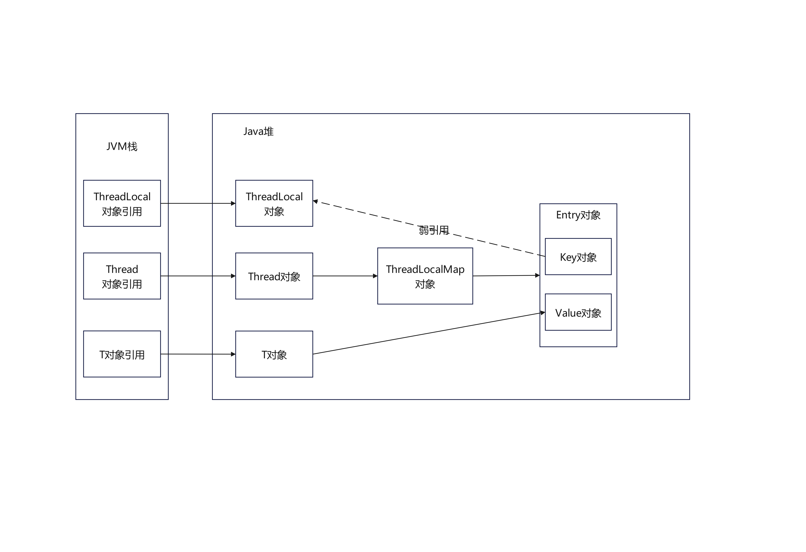
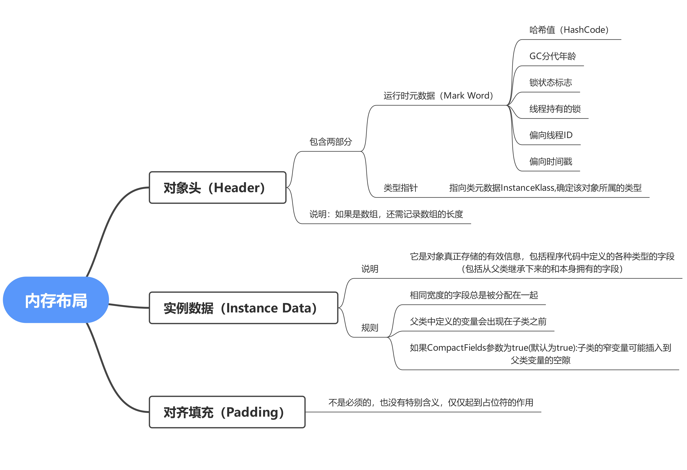
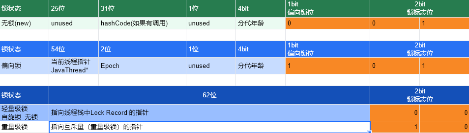

# 第1章--前置知识及要求说明

无锁->独占锁->读写锁->邮戳锁

无锁->偏向锁->轻量级锁->重量级锁

# 第2章--基础知识复习

## java多线程相关概念

- 1把锁:synchronized
- 2个并:并发，并行
- 3个程:进程,线程，管程（monitor,也就是平时说的锁，多个工作线程互斥访问共享资源）

## 用户线程和守护线程

java 线程默认是用户线程

- User Thread:系统的工作线程，用户线程的结束会导致整个程序的结束
- Daemon Thread：守护线程，守护线程的结束不会导致整个程序的结束，守护线程通常用来执行一些后台任务，如垃圾回收、日志记录等。

# 第3章--CompletableFuture

## Future接口理论知识复习

Future接口 (FutureTask实现类)定义了操作异步任务执行一些方法

## Future接口常用实现类FutureTask异步任务

Runnable接口 Callable接口 Future接口和FutureTask实现类

目的：异步多线程任务执行且返回有结果， 三个特点：多线程/有返回/异步任务 `Thread(Runnable target, String name)`

FutureTask 满足上述三个条件（见chapter03-CompletableFutureDemo）

Future对结果的获取不是很友好，只能通过阻塞或轮询的方式得到任务的结果

## CompletableFuture对Future的改进

- `CompletableFuture<T> implements Future<T>, CompletionStage<T>`
- CompletionStage 代表异步计算过程中的某一个阶段，一个阶段完成以后可能会触发另外一个阶段

### 核心的四个静态方法

- 无返回值
- `runAsync(Runnable runnable)`
- `runAsync(Runnable runnable, Executor executor)`

- 有返回值
- `supplyAsync(Supplier<U> supplier)`
- `supplyAsync(Supplier<U> supplier, Executor executor)`

上述Executor executor参数，没有指定Executor的方法，通常使用默认的ForkJoinPool.commonPool线程池来执行异步任务

## CompletableFuture的优点

从java8开始引入了CompletableFuture,它是Future的功能增强版，减少阻塞和轮询，可以传入回调对象，当异步任务完成或者发生异常时，自动调用回调对象的回调方法

- 异步任务结束时，会自动回调某个对象的方法
- 主线程设置好回调后，不再关心异步任务的执行，异步任务之间可以顺序执行
- 异步任务出错时，会自动回调某个对象的方法

## java8中引入的函数式接口

| 函数式接口名称 | 方法名称 | 参数    | 返回值   |
|----------------|----------|---------|----------|
| Runnable       | run      | 无参数  | 无返回值 | 
| Function       | apply    | 1个参数 | 有返回值 | 
| Consumer       | accept   | 1个参数 | 无返回值 | 
| Supplier       | get      | 无参数  | 有返回值 | 
| BiConsumer     | accept   | 2个参数 | 无返回值 |

## CompletableFuture的常用方法

1. 获得结果和触发计算（见chapter03/CompletableFutureAPIDemo）
    - 获取结果
        - `get()`   不见不散（阻塞）
        - `get(long timeout, TimeUnit unit)`  过时不候（阻塞）
        - `join()`   抛出运行时异常（阻塞）
        - `getNow(T valueIfAbsent)`   没有计算完成的情况下，返回valueIfAbsent值（不阻塞）
    - 主动触发计算
        - `complete(T value)`   尝试将计算结果设为 value，若当前 Future 尚未完成则设置成功并唤醒因 get()/join() 阻塞的线程，返回 true；若已完成则返回 false（不阻塞）
2. 对计算结果进行处理（见chapter03/CompletableFutureAPI2Demo）
    - `thenApply(Function<? super T,? extends U> fn)` 计算完成后对结果进行转换
      (计算结果存在依赖关系，这两个线程串行化;由于存在依赖关系，当前步骤有异常的话就被叫停)
    - `handle(BiFunction<? super T, Throwable, ? extends U> fn)` 计算完成后对结果进行转换，或者对异常进行处理
      （计算结果存在依赖关系，这两个线程串行化; 有异常也可以往下一步走，根据异常参数进一步处理）
3. 对计算结果进行消费 （见chapter03/CompletableFutureAPI3Demo）
    - `thenAccept(Consumer<? super T> action)` 计算完成后对结果进行消费,无返回结果（计算结果存在依赖关系，这两个线程串行化）
4. 线程池运行选择 （见chapter03/CompletableFutureWithThreadPoolDemo）
   以thenRun和thenRunAsync为例，thenRun在当前线程执行，thenRunAsync在默认线程池执行，当然也可以指定线程池
5. 对计算速度进行选用 (见chapter03/CompletableFutureFastDemo)
   applyToEither和acceptEither方法，applyToEither有返回值，acceptEither无返回值，两个方法都是哪个线程计算完成了就用哪个线程的结果
6. 对计算结果进行合并 (见chapter03/CompletableFutureCombineDemo)
   thenCombine方法，两个CompletionStage任务都完成后，最终能把两个任务的结果一起交给thenCombine来处理，合并的结果有返回值

# 第4章--说说java“锁”事

## 乐观锁与悲观锁

- 悲观锁：认为在多线程环境下，数据被修改的概率很大，所以每次操作数据时都要加锁，保证数据的安全性。常见的悲观锁有synchronized和ReentrantLock。（适合写操作多的场景）
- 乐观锁：认为在多线程环境下，数据被修改的概率很小，所以每次操作数据时不加锁，而是在提交数据时进行版本检查，如果版本不一致则重试。
  常见的乐观锁有CAS（Compare And Swap）和基于版本号的乐观锁。（适合读操作多的场景，并发性得到了加强）

## 8锁案例

主要是讨论：synchronized

见chapter04/Lock8Demo，注释中即为8种加锁demo场景

8种锁的案例实际体现在3个地方：

1. 作用于实例方法，当前实例加锁，进入同步代码前要获得当前实例的锁
2. 作用于代码块，对括号里配置的对象加锁
3. 作用于静态方法，当前类加锁，进入同步代码前要获得当前类对象的锁

同步代码块（见chapter04/LockSyncDemo）实现是： monitorenter 和 monitorexit
指令，monitorenter指令会尝试获取对象的锁，如果获取成功就进入同步代码块，如果获取失败就进入阻塞状态；monitorexit指令会释放对象的锁。

同步实例方法实现是： 携带方法标识，ACC_SYNCHRONIZED，JVM在执行方法时会检查这个标识，如果存在就会在方法执行前获取当前实例的锁，在方法执行后释放锁。

同步静态方法实现是： 携带方法标识，ACC_STATIC, ACC_SYNCHRONIZED，JVM在执行方法时会检查这个标识，如果存在就会在方法执行前获取当前类对象的锁，在方法执行后释放锁。

为什么任何一个对象都可以成为一个锁？ 在Hotspot虚拟机中，monitor采用ObjectMonitor实现。
ObjectMonitor是HotSpot中monitor的C++实现，每个对象并不是天生就有一个ObjectMonitor实例。线程进入synchronized同步块时，对象的Mark Word会保存一个指向ObjectMonitor实例的指针，从而把锁的管理（_owner、_EntryList、_WaitSet 等）委托给ObjectMonitor。这就是为什么任何一个对象都可以成为一个锁。

## 公平锁与非公平锁

（见chapter04/SaleTicketDemo)
`ReentrantLock lock = new ReentrantLock(true)`;// 公平锁,先来先得

`ReentrantLock lock = new ReentrantLock()`;// 非公平锁，后来的也可能先获得锁

为什么默认是非公平锁？因为非公平锁的性能更好，公平锁会增加线程切换的开销，降低系统的吞吐量。

## 可重入锁（又称递归锁）

（见chapter04/ReEntryLockDemo)
可重入锁是指同一个线程可以多次获得同一个锁，而不会发生死锁。synchronized和ReentrantLock都是可重入锁。
每个锁对象都有一个计数器，初始值为0，当线程获得锁时，计数器加1，当线程释放锁时，计数器减1，当计数器为0时，锁被释放。
每个锁对象还拥有一个指向持有该锁的线程的指针。

## 死锁及排查

（见chapter04/DeadLockDemo)
死锁是指两个或多个线程在执行过程中，因争夺资源而造成的一种互相等待的现象，导致线程无法继续执行。

如何排查死锁：

第一种方式，命令行

1. jps -l 查看线程状态
2. jstack -l 线程id 查看线程堆栈信息，找到死锁的线程和锁对象

第二种方式，jconsole工具，打开jconsole，连接到目标应用程序，选择线程标签页，查看死锁线程和锁对象

## 小结

# 第5章--LockSupport与线程中断

## 什么是中断机制

一个线程不应该由其他线程来强制中断或停止，而是应该由线程自己自行停止，自己来决定自己的命运。
java中没有办法立即停止一个线程的方法，Thread.stop ()方法已经被废弃了，因为它会导致线程不安全的状态，可能会破坏数据的一致性。

java提供了一种用于停止线程的协商机制--中断，也即中断标识协商机制。

每个线程对象中都有一个中断标识，初始值为false，当调用线程的`interrupt()`方法时， 中断标识被设置为true， 线程可以通过
`isInterrupted()`方法来检查自己的中断状态，也可以通过`interrupted()`方法来检查并清除自己的中断状态。

## 中断的相关API方法之三大方法说明

见chapter05/InterruptDemo2，InterruptDemo3，InterruptDemo4

- `interrupt()`：设置线程的中断标识为true，如果线程正在阻塞状态（如sleep、wait、join等），会抛出InterruptedException异常，并清除中断标识。
- `interrupted()`：检查线程的中断状态，并清除中断标识。
- `isInterrupted()`：检查线程的中断状态，不会清除中断标识。

### 如何中断运行中的线程

见chapter05/InterruptDemo

- 通过一个volatile变量实现 （volatileDemo方法)
- 通过AtomicBoolean实现 （atomicBooleanDemo方法)
- 通过Thread类自带的中断api实例方法实现 （apiDemo方法)

## LockSupport是什么

见chapter05/LockSupportDemo

LockSupport是java.util.concurrent.locks包中的一个工具类，提供了park ()和unpark ()方法，用于线程的阻塞和唤醒。

- `wait()和notify()`方法只能在synchronized块中使用 (见syncWaitNotify方法)
- 将notify方法放在wait方法之前调用，可能会导致线程永远等待， 因为notify是在wait之前发出的通知信号不会被保留，等线程真正调用wait时就再也收不到通知了。

- `await()和signal()`方法只能在Lock对象的条件变量上使用（见syncAwaitSignal方法）
- 将signal方法放在await方法之前调用，可能会导致线程永远等待， 因为signal是在await之前发出的通知信号不会被保留，等线程真正调用await时就再也收不到通知了。

- `park()和unpark()`方法可以在任何地方使用 (见syncParkUnpark方法)
- 将unpark方法放在park方法之前调用，不会导致线程永远等待，因为unpark方法会设置一个许可标志，允许线程在调用park
  方法时立即返回，而不会进入阻塞状态。
- 许可证不会积累，最多只有一个许可，如果线程已经有一个许可了，再调用unpark方法不会增加许可的数量，也就是说，许可证不会积累。

# 第6章--java内存模型之JMM

## 什么是java内存模型

JMM本身是一种抽象的概念并不真实存在，它仅仅描述的是一组约定或规范。 JMM的关键技术点都是围绕着可见性、有序性和原子性这三个特性来展开的。

### JMM能干嘛

1. 通过JMM来实现线程和主内存之间的抽象关系
2. 屏蔽各个硬件平台和操作系统的内存访问差异,以实现让Java程序在各种平台下都能达到一致的内存访问效果。

### JMM三大特性

- 可见性：当一个线程修改了共享变量的值，其他线程能够立即看到这个修改的结果。 (JMM规定了所有的变量都存储在主内存中)
  线程脏读：当一个线程正在修改共享变量的值时，另一个线程读取了这个共享变量的值，这时就可能会读到一个不完整的值，导致程序出现错误。
- 有序性：程序执行的顺序按照代码的先后顺序执行，但是在多线程环境下，编译器和处理器可能会对指令进行重排序优化，导致程序执行的顺序不按照代码的先后顺序执行。
  指令重排可以保证串行语义一致，但没有义务保证多线程间的语义也一致 (即可能产生“脏读”)
  处理器在进行重排序时必须考虑指令之间的数据依赖性，不能改变指令之间的依赖关系。 依赖关系分为三种：控制依赖、数据依赖和传递依赖。
- 原子性：一个操作要么全部执行成功，要么全部执行失败，不会被其他线程打断。

### JMM规范下，多线程对变量的读写过程

读写过程如下：

1. 线程从主内存中读取共享变量的值到自己的工作内存中
2. 线程在工作内存中对共享变量进行操作
3. 线程将修改后的共享变量的值写回主内存中

### JMM规范下，多线程先行发生原则之happens-before原则

在JMM中，如果一个操作执行的结果需要对另一个操作可见或者代码重排序，那么前一个操作必须先于后一个操作执行，这就是happens-before原则。
happens-before原则保证了多线程环境下的可见性和有序性。

语义本质上是一种可见性。

#### happens-before之8条

1. 次序规则：一个线程内，按照代码的先后顺序执行
2. 锁定规则：同一个 monitor 上，一个线程的解锁操作 happens-before 另一个线程对该 monitor 的后续加锁操作
3. volatile规则：一个线程对 volatile 变量的写操作 happens-before 后续任意线程对该变量的读操作
4. 传递规则：如果操作A happens-before操作B，操作B happens-before操作C，那么操作A happens-before操作C
5. 线程启动规则 (Thread Start Rule)：`Thread.start()` 的调用 happens-before 被启动线程中的任意操作
6. 线程中断规则 (Thread Interruption Rule)：对另一线程调用 `Thread.interrupt()` happens-before 被中断线程检测到中断（抛出 InterruptedException，或 `Thread.interrupted()` / `isInterrupted()` 返回 true）
7. 线程终止规则 (Thread Termination Rule)：线程 A 中的所有操作 happens-before 另一个线程在 A 上成功调用 `Thread.join()` 返回之后看到的任意操作
8. 线程终结规则 (Finalizer Rule)：一个对象的构造函数执行结束 happens-before 该对象的 `finalize()` 方法开始执行

# 第7章--volatile与JMM

## 被volatile修饰的变量具有的特性

- 可见性：当一个线程修改了volatile变量的值，其他线程能够立即看到这个修改的结果。
- 有序性：被volatile修饰的变量禁止指令重排优化，保证了程序执行的顺序按照代码的先后顺序执行。

内存语义：

1. 当写一个volatile变量时，JMM会把该线程对应的本地内存中的共享变量值立即刷新回主内存中
2. 当读一个volatile变量时，JMM会把该线程对应的本地内存设置为无效，重新回到主内存中读取最新共享变量的值到本地内存中

volatile凭什么可以保证可见性和有序性？ 内存屏障Memory Barrier，内存屏障是一种特殊的指令，用于控制指令的执行顺序和内存的可见性。

## 内存屏障

ACC_VOLATILE标识会告诉编译器和处理器，在访问volatile变量时要插入内存屏障指令，禁止指令重排优化，以保证程序的正确性。

java内存模型的重排规则会要求java编译器在生成JVM指令时插入特定的内存屏障指令来禁止指令重排优化，以保证程序的正确性。但volatile无法保证原子性。
内存屏障之前的所有写操作都要回写到主内存， 内存屏障之后的所有读操作都能获得内存屏障之前的所有写操作的最新结果（实现了可见性）。

内存屏障分为两种：读屏障和写屏障

- 写屏障（Store Memory Barrier）:告诉处理器在写屏障之前将存储在缓存（store bufferes）中的数据同步到主内存。
- 读屏障（Load Memory Barrier）: 保证屏障前的所有读操作完成后，才执行屏障后的读操作。

因此重排序时，不允许把内存屏障之后的指令重排序到内存屏障之前。
一句话：对一个volatile变量的写，先行发生于任意后续对这个volatile变量的读，也叫做写后读屏障（StoreLoad Barrier）。

## 内存屏障的分类

粗分2种：

1. 读屏障
2. 写屏障

细分4种：

1. LoadLoad Barrier：禁止把屏障之后的读操作重排序到屏障之前
2. StoreStore Barrier：禁止把屏障之后的写操作重排序到屏障之前
3. LoadStore Barrier：禁止把屏障之后的写操作重排序到屏障之前
4. StoreLoad Barrier：禁止屏障前的写操作与屏障后的读操作重排序

当第一个操作为volatile读时，不论第二个操作是什么，都不能重排序。这个操作保证了volatile读之后的操作不会被重排到volatile读之前。

当第二个操作为volatile写时，不论第一个操作是什么，都不能重排序。这个操作保证了volatile写之前的操作不会被重排到volatile写之后。

当第一个操作为volatile写，第二个操作为volatile读时，不能重排序。

当两个操作都是volatile读时，不能重排序。

当两个操作都是volatile写时，不能重排序。

java内存模型中定义的8种每个线程自己的工作内存与主物理内存之间的原子操作： read (读取)、load (加载)、use (使用)、assign
(赋值)、store (存储)、write (写入)、lock (锁定)、unlock (解锁)

## volatile不保证原子性

见chapter07/VolatileNoAtomicDemo

## 如何正确使用volatile

1. 单一赋值可以，但是含复合运算赋值不可以（i++之类 ）
2. 状态标志，判断业务是否结束
3. 开销较低的读，写锁策略
4. DCL双端锁的发布（见chapter07/DCLDemo）

# 第8章--CAS

compare and swap：比较并交换； 主要是unsafe类的功能； 当他重来重试的机制，称为自旋

## 原子类

AtomicInteger

CAS是JDK提供的非阻塞原子性操作，它通过硬件保证了比较-更新的原子性。 CAS是一条CPU的原子指令（cmpxchg指令，比较并交换），不会造成所谓的数据不一致问题。
CAS的原子性实际上是CPU实现独占的。

## unsafe类

AtomicInteger类主要利用CAS (compare and swap)+volatile和native方法来保证原子操作，从而避免synchronized的高开销，执行效率大为提升。

## 原子引用

（见chapter08/AtomicReferenceDemo）

## 自旋锁

获取锁的线程不会立即阻塞，而是采用循环的方式去尝试获取锁。

### 缺点

1. 可能会导致CPU资源的浪费，因为线程在自旋过程中会一直占用CPU资源，尤其是在高并发的情况下，自旋锁可能会导致大量的CPU资源被浪费。
2. ABA问题：在 CAS 操作中，一个线程读取共享变量值为 A，准备基于该值进行 CAS 更新之前，该值已经被其他线程修改为 B、又被改回 A，此时 CAS 比较仍会成功，但其实中间状态已经发生过变化。CAS 是无法分辨这种 "A→B→A" 变化的。

解决ABA问题的方法：使用版本号机制，在每次修改锁状态时，增加一个版本号，这样就可以区分不同的锁状态

# 第9章--原子操作类

包地址：java.util.concurrent.atomic

## 基本类型原子类

AtomicInteger、AtomicLong、AtomicBoolean等基本类型原子类，提供了原子性的操作方法， 如`get()、set()、incrementAndGet()`等。
（见chapter09/AtomicIntegerDemo）

## 数组类型原子类

AtomicIntegerArray、AtomicLongArray、AtomicReferenceArray等数组类型原子类，提供了原子性的操作方法， 如
`get()、set()、incrementAndGet()`等。 （见chapter09/AtomicIntegerArrayDemo）

## 引用类型原子类

AtomicReference、AtomicStampedReference、AtomicMarkableReference等引用类型原子类，提供了原子性的操作方法， 如
`get()、set()、compareAndSet()`等。 （见chapter09/AtomicMarkableReferenceDemo）

## 对象的属性修改原子类

AtomicIntegerFieldUpdater、AtomicLongFieldUpdater、AtomicReferenceFieldUpdater等对象属性修改原子类，提供了原子性的操作方法，
如`get()、set()、compareAndSet()`等。

（见chapter09/AtomicIntegerFieldUpdaterDemo，chapter09/AtomicReferenceFieldUpdaterDemo）

基于反射的实用程序，可对指定类的指定volatile int字段/volatile long字段/volatile引用字段进行原子更新。
该类适用于那些需要在原子更新的字段上使用对象引用的类。

使用目的：以一种线程安全的方式操作非线程安全对象内的某些字段。

## 原子操作增强类原理深度解析

DoubleAccumulator、LongAccumulator等原子操作增强类，提供了原子性的操作方法，如get ()、set ()、accumulate ()等。
DoubleAdder、LongAdder等原子操作增强类，提供了原子性的操作方法，如get ()、set ()、increment ()等。

## LongAdder和LongAccumulator的原理解析

如果是JDK8,推荐使用LongAdder对象，比AtomicLong对象性能更好 (减少乐观锁的重试次数)，
LongAdder内部维护了一个Cell数组，每个线程在更新时会随机选择一个Cell进行更新，减少了竞争，提高了性能。

`LongAdder()` 创建一个初始总和为0的新加法器。

`LongAdder(long identity)` 创建一个初始总和为identity的新加法器。

LongAdder是Striped64的子类， Striped64内部维护了一个Cell数组，每个Cell对象包含一个volatile long类型的value字段，用于存储当前Cell的值。
LongAdder的基本思路就是分散热点，将value值分散到一个Cell数组中，不同线程会命中到数据的不同槽中，各个线程只对自己槽中的那个值进行CAS操作，这样热点就被分散了，冲突的概率就小很多，
如果要获取真正的long值，只要将各个槽中的变量值累加返回。

`sum()`会将所有Cell数组中的value和base累加作为返回值。 `sum()`执行时，并没有限制对base和cell的更新 (一句要命的话)
。所以LongAdder不是强一致性的，它是最终一致性的，可能会读到过时的值。 保证性能，精度代价。

cell数组的长度是2的幂次方，默认是2

longAdder add方法的步骤：

1. 最初无竞争时只更新base;
2. 如果更新base失败后，首次新建一个Cell[]数组，长度为2，
3. 当多个线程竞争同一个cell比较激烈时，可能就要对Cell[]数组扩容，直到成功为止。

longAccumulate 方法的步骤： 在一个for (;;)自旋中，自旋分为三个分支：

- CASE1:Cell[]数组已经初始化
- CASE2:Cell[]数组未初始化 (首次新建)
- CASE3:Cell[]数组正在初始化 (兜底)，直接更新base

# 第10章--聊聊ThreadLocal

ThreadLocal是一个线程局部变量，ThreadLocal为每个使用该变量的线程提供独立的变量副本，每个线程都可以独立地改变自己的副本，而不会影响其他线程的副本。

ThreadLocal最好设置下初始值，ThreadLocal.withInitial ()

## Thread,ThreadLocal,ThreadLocalMap之间的区别

每个Thread中有ThreadLocal;ThreadLocal中有静态内部类ThreadLocalMap;

ThreadLocalMap实际上是一个以ThreadLocal实例为key,任意对象为value的Entry对象； Entry extends WeakReference<ThreadLocal<?>>
，

当ThreadLocal实例被垃圾回收时，Entry对象并不会被GC回收——Entry仍然被ThreadLocalMap内部的table[]强引用着，里面又强引用着 value 对象，因此 value 会一直留在内存中，必须依靠 `remove()` 主动清理。这就是 ThreadLocal 在线程复用场景下容易内存泄漏的根本原因。

## 为什么ThreadLocalMap的key是弱引用

如果 ThreadLocalMap 中的 Entry 持有 ThreadLocal 实例的强引用，那么只要线程存活，ThreadLocalMap 一直强引用着 ThreadLocal，ThreadLocal 就永远无法被 GC，生命周期与线程强绑定。因此 Entry 的 key 设计为 WeakReference：一旦外部对 ThreadLocal 的强引用消失（例如方法返回、局部变量出栈），GC 时 key 会被自动置为 null，从而有机会释放该 ThreadLocal 关联的资源。

但注意：key 被置为 null 并不代表 Entry 和 value 也被回收，因为 Thread Ref -> Thread -> ThreadLocalMap -> Entry -> value 这条强引用链依然存在。所以线程被复用（线程池场景）时，key 为 null 的"脏 entry"会不断累积，必须依靠 `remove()` 方法手动清理，否则仍然会内存泄漏。

## 最佳实践

1. `ThreadLocal.withInitial(()->初始化值)`
2. 建议把ThreadLocal修饰为static
3. 用完记得手动remove (强制)

# 第11章--Java对象内存布局和对象头

可以参考JVM实战的第10章--对象的实例化内存布局与访问定位之对象的内存布局

对象在堆内存中的存储布局可以分为三个部分：对象头（Header）、实例数据（Instance Data）和对齐填充 (Padding，保证8个字节的倍数)

## 对象头

1. 对象标记（Mark Word）
2. 类元信息（又叫类型指针）

对象头分为对象标记（markOop，HotSpot 内部 C++ 类型，对应 Mark Word 的内部表示）和类元信息（klassOop/Klass，HotSpot 内部 C++ 类型），类元信息存储的是指向该对象类元数据（klass）的首地址.

在64位系统中，Mark Word中占了8个字节，类型指针占了8个字节，一共是16个字节（例如new Object () 没有实例数据时，16个字节大小）；开启指针压缩（-XX:+UseCompressedOops，默认开启）后类型指针压缩为4字节，整体12字节，按8字节对齐到16字节。

biased_lock：偏向锁

关于锁： 偏向锁，轻量级锁，重量级锁

类型指针的压缩，以节约空间（默认开启），将8字节压缩成4字节

## JOL (java object layout)

分析java对象在jvm中的大小

## 对象分代年龄

年龄为15的原因：对象分代年龄占4位，最大为1111，即15

# 第12章--synchronized与锁升级

synchronized属于重量级锁，效率低下，因为监视器锁（monitor）是依赖于底层的操作系统的Mutex Lock (系统互斥量)来实现的。
每一个java对象都有成为Monitor的潜质，因为在java的设计中，每一个java对象自从创建就带了一把看不见的锁，它叫做内部锁或者Monitor锁。

## Monitor与java对象以及线程是如何关联的？

1. 如果一个java对象被某个线程锁住，则该java对象的Mark Word 字段中LockWord指向monitor的起始地址
2. Monitor 的Owner字段会存在拥有相关联对象锁的线程id；

Mutex Lock 的切换需要从用户态切换到核心态，因此状态转换需要耗费很多的处理器时间。

## 锁升级步骤

锁的升级过程： 无锁（001）->偏向锁（101）->轻量级锁（00）->重量级锁（10）

## 偏向锁

目的是减少线程在用户态与内核态之间切换 适用于单线程反复访问同步块的场景 当一段同步代码一致被同一个线程多次访问，由于只有一个线程，那么该线程在后续访问时便会自动获得锁。
偏向锁会偏向于第一个访问锁的线程。 锁总是被第一个占用他的线程拥有，这个线程就是锁的偏向线程。

注意：偏向锁只有其他线程尝试竞争偏向锁时，持有偏向锁的线程才会释放锁，线程是不会主动释放偏向锁的。
当一个synchronized方法被一个线程抢到锁时，锁对象的Mark Word中前54位来存储抢到锁的线程指针作为标识；
当该线程再次访问这个synchronized方法时，该线程只需校验锁对象头的Mark Word中的前54位是否是当前线程指针，是的话，无需再进入monitor去竞争锁对象了。

### 启动偏向锁

见（chapter12/SynchronizedUpDemo）

在jdk8,默认启动，启动时间有4s延迟

java -XX:+printFlagsInitial | grep BiasedLock*

## 偏向锁撤销

当有另外线程逐步来竞争锁的时候，就不能再使用偏向锁了，要升级为轻量级锁 竞争线程尝试CAS更新对象头失败，会等待到全局安全点（此时不会执行任何代码）撤销偏向锁。

java15逐步废弃偏向锁

## 轻量级锁

有线程来参与锁的竞争，但是竞争不激烈 通过CAS减少重量级锁的使用

如果关闭偏向锁，就可以直接进入轻量级锁

java6之前，默认启用，默认情况下自旋的次数是10次，或者自旋线程数超过cpu核数一半； java6之后，自适应自旋锁：根据同一个锁上一次自旋的时间，拥有锁线程的状态来决定。

轻量级锁每次退出同步块都需要释放锁，而偏向锁是在竞争发生时才释放锁。

## 重量级锁

java中synchronized的重量级锁，是基于进入和退出Monitor对象实现的。 如果获取到了锁，会在monitor的owner中存放当前线程的id。

锁升级为轻量级或者重量级锁后，Mark Word中已经没有位置再保存哈希码了。

如果一个对象的`hashCode()`方法已经被调用过一次后，这个对象不能被设置偏向锁； 因为Mark Word中的hashCode必然会被偏向线程id覆盖，
会造成前后两次调用`hashCode()`获得的值不一致。

偏向锁过程中遇到 hashCode() 调用请求，立马撤销偏向模式，膨胀为重量级锁。（见SynchronizedUpDemo）

升级为轻量级锁后，JVM会在当前线程的栈帧中创建一个锁记录（Lock Record）空间，用于存储锁对象的Mark Word 拷贝; 该拷贝中可以包含hash
code,GC年龄;锁释放后会将这些信息写回到对象头；

升级为重量级锁后，Mark Word保存的重量级锁指针，代表重量级锁的ObjectMonitor类里有字段记录非加锁状态下的Mark Word,
锁释放后也会将信息写回到对象头。

## JIT编译器对锁的优化

锁清除：见chapter12/LockClearUPDemo

锁粗化：见chapter12/LockBigDemo

# 第13章--AbstractQueuedSynchronizer之AQS

抽象队列同步器； 是整个JUC的基石，解决锁分配给谁的问题

同步器：面向锁的实现者

整体就是一个抽象的FIFO队列（CLH队列）来完成资源获取线程的排队工作，并通过一个int类变量表示持有锁的状态。

CLH队列是一个单向链表，AQS中的队列是CLH变体的虚拟双向队列FIFO。

## AQS能干什么

加锁会导致阻塞，有阻塞就需要排队，实现排队必然需要队列。

## AQS自身

AQS的同步状态state成员变量：private volatile int state;

AQS的Node队列。从尾部入队，从头部出队。 Node的等待状态：volatile int waitStatus;

## 源码分析

## ReentrantLock

默认非公平锁（效率高，降低了切换线程的开销）

公平锁与非公平锁的差异：

公平锁（FairSync）的tryAcquire方法中有hasQueuedPredecessors方法，这个是公平锁加锁时判断等待队列中是否存在有效节点的方法（是否有排在当前线程前面的线程）
`注：Predecessors可以理解为前驱们，就是在我这个线程之前的线程们`

### lock

AQS acquire主要有三条流程：

1. 调用tryAcquire,交由子类FairSync实现
2. 调用addWaiter, enq 入队操作
3. 调用acquireQueued，调用 cancelAcquire

### unlock

`sync.release(1)` -> `tryRelease(arg)` -> `unparkSuccessor`

在unparkSuccessor方法中，unpark唤醒下一个线程

### acquireQueued的cancelAcquire

中断等待

# 第14章--ReentrantLock、ReentrantReadWriteLock、StampedLock（邮戳锁，票据锁）讲解

## ReentrantReadWriteLock是什么

见（chapter14/ReentrantReadWriteLock）

读写锁定义：一个资源能够被多个读线程访问，或者被一个写线程访问，但是不能同时存在读写线程。

读多写少的时候，读写锁相比独占锁，比较好。

读读线程间并不存在互斥关系。读读共存，读写互斥。

读锁没有完成时，其他线程写锁无法获得。这是一种悲观的读锁。

缺点：

1. 写锁饥饿问题（读多写少的时候，容易造成写锁抢不到资源）
2. 注意，锁降级（遵循获取写锁，获取读锁再释放写锁的次序，写锁能够降级成为读锁；但是从读锁定升级到写锁是不可能的。）

## StampedLock

读的过程中也允许获得写锁接入，这是一种乐观的读锁。 StampedLock是JDK1.8新增的一个读写锁。
注意：StampedLock 没有公平/非公平模式。

使用公平策略（`new ReentrantReadWriteLock(true)`）可以一定程度上缓解 ReentrantReadWriteLock 的锁饥饿问题，但是公平策略是以牺牲系统吞吐量为代价的。

## StampedLock的特点

1. 所有获取锁的方法，都返回一个邮戳（Stamp）
2. 所有释放锁的方法，都需要一个邮戳（Stamp）
3. StampedLock是不可重入的，危险（如果一个线程已经持有了写锁，再去获取写锁的话就会造成死锁）
4. 三种访问模式
    1. Reading (读模式悲观)
    2. Writing (写模式)
    3. Optimistic reading (乐观读模式)：无锁机制。

       类似于数据库中的乐观锁 支持读写并发，很乐观认为读取时没人修改，假如被修改再实现升级为悲观读模式

## StampedLock的缺点

1. 不支持重入，没有Re开头
2. StampedLock的悲观读锁和写锁都不支持条件变量（Condition）
3. 使用StampedLock一定不要调用中断操作，即不要调用interrupt方法

# 第15章--课程总结与回顾

1. CompletableFuture
2. "锁"事儿
3. JMM
4. synchronized及升级优化
5. CAS
6. volatile
7. LockSupport和线程中断
8. AQS
9. ThreadLocal
10. 原子增强类Atomic